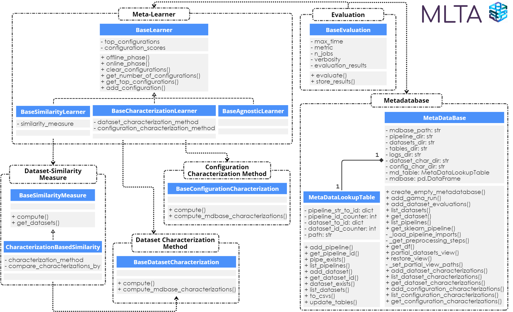

# Meta-Learning Toolbox for AutoML (MLTA) 
-----
Meta-learning toolbox created for Master's Thesis Data Science & AI @ TU/e. More information concerning the creation, goal and usage of the toolbox is present in the thesis (see `../docs/MLTA_Master_Thesis`) -- which also includes code examples. You can access the associated metadatabase storing the metadataset, datasets, logs and characterizations [here](https://drive.google.com/file/d/135SYH96k2G24AieWdRFWf4FXVmuSq_J9/view?usp=sharing).


## Framework
-----
The meta-learning toolbox adopts a framework consisting of the following components:  meta-learners, dataset characterization methods, dataset similarity
measures, configuration characterization methods, evaluation methods and a metadatabase.
The framework is depicted in the figure below, detailing the interactions between components.



## Tools
------
### Included tools
MLTA provides the following meta-learning components adhering to the aformentioned framework:
- Dataset Characterization Methods: `PreTrainedDataset2Vec`, `FeurerMetaFeatures` and `WistubaMetaFeatures` which can be imported from `dataset_characterization`.
- Configuration Characterization Methods: `AlgorithmsPropositionalization` and `RankMLPipelineRepresentation` which can be imported from `configuration_characterization`.
- Meta-learners: `AverageRegretLearner`, `UtilityEstimateLearner`, `TopXGBoostRanked`, `TopSimilarityLearner` and `PortfolioBuilding` which can be imported from `metalearners`
- Dataset-Similarity Measures: Up until now only a method that operates with any dataset characterization method, `CharacterizationSimilarity` which can be imported from `dataset_similarity`. 

In addition to this we provide metadatabase functionality via `MetaDataBase` which can be imported from `metadatabase`, and leave-one-dataset-out evaluation functionality `LeaveOneDatasetOutEvaluation` which can be imported from `evaluation`

### Extending the toolbox
You can extend the toolbox / include other methods by extending from a suitable base class:
- `BaseSimilarityLearner` for similarity-based meta-learners
- `BaseCharacterizationlearner` for characterization-based meta-learners
- `BaseAgnosticLearner` for dataset-agnostic meta-learners
- `BaseSimilarityMeasure` for dataset similarity measures
- `BaseConfigurationCharacterization` for configuration characterization methods
- `BaseDatasetCharacterization` for dataset characterizations methods
- `BaseEvaluation` for other evaluation methods

## Thesis Results Reproducibility
-----
The processed thesis results are located in the `evaluations_results` directory. You can re-create these results by running the code in the `reproduce_results.ipynb` Jupyter Notebook. To run that code it is important to do the following:
- include the aformentioned metadatabase in the same directory as the notebook
- to run it using an environment that confirms to `requirements.txt`
- include a version (e.g. in a local directory) of GAMA that supports warm-starting via individual strings, for instance [this branch](https://github.com/openml-labs/gama/tree/fix_warm_start).

After reproducing these results, or by using the already present results, you can re-create the statistical tests, figures, tables, and run time analysis using the `evaluation_results/analysis/analyze_results.ipynb` Notebook. If you were to recreate the full results from scratch (the above steps) then please format the results you get therefrom as the files in the directory, e.g. combining all single meta-learning results files in a full file. To run these analysis you need to do the following:
- to run it using an environment that confirms to `requirements.txt` 
- include a local copy of the [critdd package](https://github.com/mirkobunse/critdd) in the `evaluation_results/analysis` directory. This package is used to create the CD-diagrams.

If you fail to reproduce any of the results please open a Github issue, if this is left unresponded you can contact me via ljpcvg@gmail.com

## Code Examples
-----
### Example 1
Code example for dataset characterizations using Dataset2Vec and the metadatabase functionality. The example assumes to have an already created metadatabase in the directory "metadatabase\_openml18cc". Other dataset characterization methods operate similarly.
```python
from mlta.dataset_characterization import PreTrainedDataset2Vec
from mlta.metadatabase import MetaDataBase

mdbase = MetaDataBase(path="metadatabase_openml18cc") # initialize metadatabase from "metadatabase_openml18cc" directory
X, y = mdbase.get_dataset(dataset_id=0, type="dataframe") # get dataset with id 0 in pd.DataFrame format

d2v_characterization_method = PreTrainedDataset2Vec(split_n=0, n_batches=10)  # initialize the characterization method
d2v_char = d2v_characterization_method.compute(X, y)  # compute the characterization for dataset with id 0

# compute dataset2vec characterizations for entire mdbase and store them accordingly
d2v_characterizations = d2v_characterization_method.compute_mdbase_characterizations(mdbase=mdbase)  
mdbase.add_dataset_characterizations(characterizations=d2v_characterizations, name="dataset2vec_split0_10batches")

# retrieve computed characterizations from metadatabase, possibly specifying the dataset ids
retrieved_d2v_characterizations = mdbase.get_dataset_characterization (characterization_name="dataset2vec_split0_10batches")
d2v_dataset0_char = mdbase.get_dataset_characterizations(characterization_name="dataset2vec_split0_10batches", dataset_ids=[0])
```

-----
### Example 2
Code example for a characterization-based meta-learner depicting MLTA's modularity. It uses the RankML meta-learner, with Wistuba et al. meta-features as dataset characterization method, and the RankML configuration characterization method. For the online phase we specify we desire 25 configurations to be recommended, without evaluating them on the new dataset, in at most 5 minutes time. Additionally, we specified we only want to consider the 500 top-performing configurations per dataset as candidate models. The second example shows how to use pre-computed and stored dataset and configuration characterizations to avoid expensive offline phase computation. The example assumes to have an already created metadatabase in the directory "metadatabase\_openml18cc" with dataset and configuration characterizations added. Other meta-learners function similarly.
```python
from mlta.metadatabase import MetaDataBase
from mlta.dataset_characterization import WistubaMetaFeatures
from mlta.configuration_characterization import RankMLPipelineRepresentation
from mlta.metalearners import TopXGBoostRanked

# initialize metadatabase from "metadatabase_openml18cc" directory
mdbase = MetaDataBase(path="metadatabase_openml18cc") 

# create meta-learner
metalearner = TopXGBoostRanked(dataset_characterization_method=WistubaMetaFeatures(), configuration_characterization_method=RankMLPipelineRepresentation(mdbase=mdbase))

# offline phase: train the model on entire mdbase but dataset with id 0, 
# online phase: recommend 25 configurations for dataset with id 0. 
mdbase.partial_datasets_view(datasets=[0])  # remove all info w.r.t. dataset 0
metalearner.offline_phase(mdbase=mdbase)
mdbase.restore_view()
X, y = mdbase.get_dataset(dataset_id=0, type="dataframe")
metalearner.online_phase(X, y, max_time=300, evaluate_recommendations=False, metric="neg_log_loss", total_n_configs=25, max_n_models=500)
top25_configs = metalearner.get_top_configurations()

# 2nd option: use pre-computed dataset & configuration characterizations in mdbase.
metalearner.clear_configurations()  # remove configurations from prior online phase
mdbase.partial_datasets_view(datasets=[0])  # remove all dataset 0 info, also chars
metalearner.offline_phase(mdbase=mdbase, dataset_characterizations_name="wistuba_metafeatures", configuration_characterizations_name="rankml_pipeline_representation")
mdbase.restore_view()
X, y = mdbase.get_dataset(dataset_id=0, type="dataframe")
metalearner.online_phase(X, y, max_time=300, evaluate_recommendations=False, metric="neg_log_loss", total_n_configs=25, max_n_models=500)
top25_configs = metalearner.get_top_configurations()
```

-----
### Example 3
Code example for the baseline similarity-based meta-learner Utility Estimate, using a characterization based dataset similarity measure employing Feurer meta-features and cosine similarity.

```python
from mlta.dataset_similarity import CharacterizationSimilarity
from mlta.dataset_characterization import FeurerMetaFeatures
from mlta.metalearners import UtilityEstimateLearner

sim_measure = CharacterizationSimilarity(characterization_method=FeurerMetaFeatures(), compare_characterizations_by="cosine_similarity")
metalearner = UtilityEstimateLearner(similarity_measure=sim_measure)
```

-----
### Example 4
Code example for evaluating a meta-learner. Due to the MLTA framework we need not bother with evaluation, dataset and metadataset related operations. The example assumes to have an already created metadatabase in the directory "metadatabase\_openml18cc". Other meta-learners can be evaluated similarly.

```python
from mlta.metadatabase import MetaDataBase
from mlta.metalearners import PortfolioBuilding
from mlta.evaluation import LeaveOneDatasetOutEvaluation

mdbase = MetaDataBase(path="metadatabase_openml18cc") 
metalearner = PortfolioBuilding()
evaluation_method = LeaveOneDatasetOutEvaluation(validation_strategy="holdout", test_size=0.2, n_configs=25, max_time=300)
evaluation_results = evaluation_method.evaluate(mdbase, metalearner)
```
